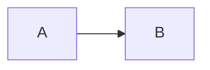

# Changelog

## v3.0.0 (2025-10-28) - CURRENT

**BREAKING CHANGE**: Render blocks saved in file

Major redesign for simplicity and practicality:

### What's New
- Rendered ASCII diagrams are **saved in the file** in special ` ```mermaid-ascii-render ` code blocks
- Diagrams viewable **without the plugin** - in GitHub, text editors, printed documents, etc.
- Auto-updates render when you edit mermaid code and move cursor away
- Much simpler implementation - no virtual text or concealment complexity

### File Format
```markdown


```mermaid-ascii-render
┌───┐     ┌───┐
│   │     │   │
│ A ├────►│ B │
│   │     │   │
└───┘     └───┘
```
```

### Benefits
- ✅ Viewable anywhere (GitHub, cat, less, print)
- ✅ Both source and render preserved
- ✅ Auto-updating (optional)
- ✅ Simple file format
- ✅ Works with any Vim version

### Migration from v2.0
The v2.0 virtual text approach is preserved in the `virtual-text-approach` branch.

## v2.0.0 (2025-10-28) - ARCHIVED

**Branch**: `virtual-text-approach`

Used Vim text properties with virtual text to display diagrams without modifying buffer.

### Issues
- Only showed one rendered block at a time
- Complex implementation with concealment
- Required Vim 9.1+ features
- Not viewable outside Vim

## v1.x (2025-10-28) - DEPRECATED

Initial versions that replaced buffer content with rendered ASCII.

### Issues Fixed in v2.0
- Files marked as modified after rendering
- Could accidentally save ASCII art instead of mermaid code
- Auto-toggle behavior was confusing

## Development History

1. **v1.0**: Buffer replacement approach
2. **v1.1**: Fixed modified flag issue
3. **v1.2**: Added block-level toggle
4. **v2.0**: Virtual text approach (buffer never modified)
5. **v3.0**: Render blocks saved in file (current)

Each version addressed specific user feedback and improved the plugin!
