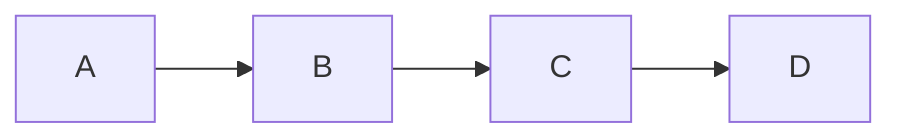

# vim-mermaid-ascii

A Vim plugin that renders Mermaid diagrams as ASCII art inline using [mermaid-ascii](https://github.com/AlexanderGrooff/mermaid-ascii), **without modifying the buffer content**.

## Features

- **Visual-only rendering**: Diagrams are displayed using Vim's folding mechanism - your mermaid code is never modified
- **Save safely**: The file always contains the original mermaid code, rendered diagrams are display-only
- **Toggle rendering**: Show/hide ASCII art with simple commands
- **Block-level control**: Render individual diagrams or all at once

## How It Works

The plugin uses Vim's folding feature with custom fold text to display rendered ASCII diagrams. The actual buffer content (what gets saved to disk) **always** contains your original ```mermaid``` code blocks. The rendered ASCII art is purely visual.

## Requirements

- Vim 8.0+ or Neovim
- [mermaid-ascii](https://github.com/AlexanderGrooff/mermaid-ascii) binary in your PATH

## Installation

### Installing mermaid-ascii

Download the binary from the [releases page](https://github.com/AlexanderGrooff/mermaid-ascii/releases):

```bash
curl -s https://api.github.com/repos/AlexanderGrooff/mermaid-ascii/releases/latest | \
  grep "browser_download_url.*mermaid-ascii" | \
  grep "$(uname)_$(uname -m)" | \
  cut -d: -f2,3 | tr -d \" | wget -qi -
tar xvzf mermaid-ascii_*.tar.gz
sudo mv mermaid-ascii /usr/local/bin/
```

### Installing the plugin

#### Using vim-plug

```vim
Plug 'normen/vim-mermaid-ascii'
```

#### Using Vundle

```vim
Plugin 'normen/vim-mermaid-ascii'
```

#### Using Pathogen

```bash
cd ~/.vim/bundle
git clone https://github.com/normen/vim-mermaid-ascii.git
```

#### Manual installation

```bash
git clone https://github.com/normen/vim-mermaid-ascii.git
cp -r vim-mermaid-ascii/plugin ~/.vim/
cp -r vim-mermaid-ascii/autoload ~/.vim/
```

## Usage

### Commands

- `:MermaidAsciiRender` - Render all mermaid blocks as folds
- `:MermaidAsciiUnrender` - Remove all folds, show original code
- `:MermaidAsciiToggle` - Toggle between rendered and original state  
- `:MermaidAsciiToggleBlock` - Toggle the current block only

### Default Keybindings

- `<Leader>mr` - Render mermaid blocks
- `<Leader>mu` - Unrender mermaid blocks  
- `<Leader>mt` - Toggle rendering
- `<Leader>mb` - Toggle current block

### How to Use

1. Open a file with mermaid code blocks
2. Run `:MermaidAsciiRender` - mermaid blocks become folded and display ASCII art
3. To edit a block: position cursor on the fold and use `zo` to open it, or use `:MermaidAsciiToggleBlock`
4. Edit the mermaid code as normal
5. Re-render with `:MermaidAsciiRender` or toggle the block

**Important**: When you save the file (`:w`), only the original mermaid code is saved. The rendered ASCII art is display-only!

## Configuration

```vim
" Set the path to mermaid-ascii binary (default: 'mermaid-ascii')
let g:mermaid_ascii_bin = '/path/to/mermaid-ascii'

" Disable default keybindings (default: 0)
let g:mermaid_ascii_no_mappings = 1

" Custom mermaid-ascii options (default: '')
let g:mermaid_ascii_options = '--borderPadding 2 --paddingX 8'
```

## Example

Given this markdown with a mermaid block:

~~~markdown
# My Diagram


~~~

After running `:MermaidAsciiRender`, the mermaid block becomes a fold displaying:

```
# My Diagram

┌───┐     ┌───┐     ┌───┐     ┌───┐
│   │     │   │     │   │     │   │
│ A ├────►│ B ├────►│ C ├────►│ D │
│   │     │   │     │   │     │   │
└───┘     └───┘     └───┘     └───┘
```

But when you save the file, it contains the original mermaid code! The ASCII art is just a visual display.

To edit: use `zo` to open the fold or use `:MermaidAsciiToggleBlock`

## License

MIT License - see LICENSE file for details.
