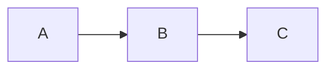
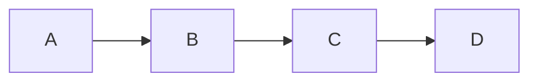

# vim-mermaid-ascii

A Vim plugin that renders Mermaid diagrams as ASCII art using [mermaid-ascii](https://github.com/AlexanderGrooff/mermaid-ascii). The rendered diagrams are **saved in the file** in special code blocks, making them viewable without the plugin.

## Features

- **Persistent rendering**: ASCII art is saved in ````mermaid-ascii-render` blocks below your mermaid code
- **Viewable anywhere**: Rendered diagrams are part of the file - view/print without Vim or the plugin
- **Auto-update**: When you edit mermaid code and move the cursor away, the render block updates automatically
- **Toggle control**: Add/remove render blocks for individual diagrams or all at once

## How It Works

The plugin inserts a special code block after each mermaid diagram:

```markdown


```mermaid-ascii-render
┌───┐     ┌───┐     ┌───┐
│   │     │   │     │   │
│ A ├────►│ B ├────►│ C │
│   │     │   │     │   │
└───┘     └───┘     └───┘
```
```

**Edit the mermaid block, not the render block!** The render block updates automatically when you move your cursor away.

## Requirements

- Vim 8.0+ or Neovim
- [mermaid-ascii](https://github.com/AlexanderGrooff/mermaid-ascii) binary in your PATH

## Installation

### Installing mermaid-ascii

Download the binary from the [releases page](https://github.com/AlexanderGrooff/mermaid-ascii/releases):

```bash
curl -s https://api.github.com/repos/AlexanderGrooff/mermaid-ascii/releases/latest | \
  grep "browser_download_url.*mermaid-ascii" | \
  grep "$(uname)_$(uname -m)" | \
  cut -d: -f2,3 | tr -d \" | wget -qi -
tar xvzf mermaid-ascii_*.tar.gz
sudo mv mermaid-ascii /usr/local/bin/
```

### Installing the plugin

#### Using vim-plug

```vim
Plug 'normen/vim-mermaid-ascii'
```

#### Using Vundle

```vim
Plugin 'normen/vim-mermaid-ascii'
```

#### Using Pathogen

```bash
cd ~/.vim/bundle
git clone https://github.com/normen/vim-mermaid-ascii.git
```

#### Manual installation

```bash
git clone https://github.com/normen/vim-mermaid-ascii.git
cp -r vim-mermaid-ascii/plugin ~/.vim/
cp -r vim-mermaid-ascii/autoload ~/.vim/
```

## Usage

### Commands

- `:MermaidAsciiRender` - Create/update render blocks for all mermaid diagrams
- `:MermaidAsciiUnrender` - Remove all render blocks  
- `:MermaidAsciiToggle` - Toggle render blocks for all diagrams
- `:MermaidAsciiToggleBlock` - Toggle render block for current diagram

### Default Keybindings

- `<Leader>mr` - Render all diagrams
- `<Leader>mu` - Unrender all diagrams
- `<Leader>mt` - Toggle all
- `<Leader>mb` - Toggle current diagram

### How to Use

1. Write your mermaid code in ` ```mermaid ` blocks
2. Run `:MermaidAsciiRender` - render blocks are inserted below each diagram
3. Edit the mermaid code (not the render block!)
4. Move cursor away - render block updates automatically
5. Save the file - both mermaid code and renders are saved

**The render blocks are viewable in any text editor, GitHub, or when printed!**

## Configuration

```vim
" Set the path to mermaid-ascii binary (default: 'mermaid-ascii')
let g:mermaid_ascii_bin = '/path/to/mermaid-ascii'

" Disable auto-update when leaving mermaid blocks (default: 1)
let g:mermaid_ascii_auto_update = 0

" Disable default keybindings (default: 0)
let g:mermaid_ascii_no_mappings = 1

" Custom mermaid-ascii options (default: '')
let g:mermaid_ascii_options = '--borderPadding 2 --paddingX 8'
```

## Example

Original markdown:

~~~markdown
# My Diagram


~~~

After `:MermaidAsciiRender`:

~~~markdown
# My Diagram


```mermaid-ascii-render
┌───┐     ┌───┐     ┌───┐     ┌───┐
│   │     │   │     │   │     │   │
│ A ├────►│ B ├────►│ C ├────►│ D │
│   │     │   │     │   │     │   │
└───┘     └───┘     └───┘     └───┘
```
~~~

**Both blocks are saved!** The ASCII art is viewable in GitHub, any text editor, or when printed.

## License

MIT License - see LICENSE file for details.
