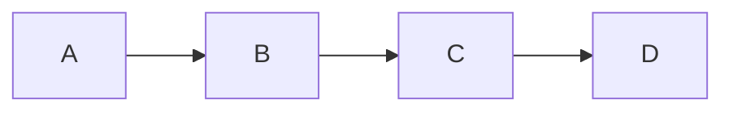

# vim-mermaid-ascii

A Vim plugin that renders Mermaid diagrams as ASCII art inline in your buffer using [mermaid-ascii](https://github.com/AlexanderGrooff/mermaid-ascii).

## Features

- **Toggle rendering**: Replace ` ```mermaid ``` ` code blocks with ASCII art
- **Smart cursor behavior**: Automatically show original Mermaid code when cursor enters a rendered block
- **Seamless editing**: Edit the Mermaid code, then re-render when you leave the block

## Requirements

- Vim 8.0+ or Neovim
- [mermaid-ascii](https://github.com/AlexanderGrooff/mermaid-ascii) binary in your PATH

## Installation

### Installing mermaid-ascii

Download the binary from the [releases page](https://github.com/AlexanderGrooff/mermaid-ascii/releases):

```bash
curl -s https://api.github.com/repos/AlexanderGrooff/mermaid-ascii/releases/latest | \
  grep "browser_download_url.*mermaid-ascii" | \
  grep "$(uname)_$(uname -m)" | \
  cut -d: -f2,3 | tr -d \" | wget -qi -
tar xvzf mermaid-ascii_*.tar.gz
sudo mv mermaid-ascii /usr/local/bin/
```

### Installing the plugin

#### Using vim-plug

```vim
Plug 'normen/vim-mermaid-ascii'
```

#### Using Vundle

```vim
Plugin 'normen/vim-mermaid-ascii'
```

#### Using Pathogen

```bash
cd ~/.vim/bundle
git clone https://github.com/normen/vim-mermaid-ascii.git
```

#### Manual installation

```bash
git clone https://github.com/normen/vim-mermaid-ascii.git
cp -r vim-mermaid-ascii/plugin ~/.vim/
cp -r vim-mermaid-ascii/autoload ~/.vim/
```

## Usage

### Commands

- `:MermaidAsciiRender` - Render all mermaid blocks in the current buffer
- `:MermaidAsciiUnrender` - Show original mermaid code for all blocks
- `:MermaidAsciiToggle` - Toggle between rendered and original state
- `:MermaidAsciiToggleBlock` - Toggle the current block under cursor

### Default Keybindings

- `<Leader>mr` - Render mermaid blocks
- `<Leader>mu` - Unrender mermaid blocks
- `<Leader>mt` - Toggle rendering
- `<Leader>mb` - Toggle current block

### Automatic Behavior

When you run `:MermaidAsciiRender`, auto-rendering is enabled. By default, this means when you move your cursor into a rendered mermaid block, it automatically shows the original code for editing. When you move the cursor out, it re-renders the ASCII art.

When you run `:MermaidAsciiUnrender`, auto-rendering is disabled. The blocks stay as mermaid code and won't auto-render when you move your cursor.

If you prefer to manually toggle individual blocks, you can disable the auto-toggle behavior:
```vim
let g:mermaid_ascii_auto_toggle = 0
```
Then use `:MermaidAsciiToggleBlock` or `<Leader>mb` to toggle individual blocks manually.

## Configuration

```vim
" Set the path to mermaid-ascii binary (default: 'mermaid-ascii')
let g:mermaid_ascii_bin = '/path/to/mermaid-ascii'

" Disable automatic rendering on cursor move (default: 0)
let g:mermaid_ascii_no_auto = 1

" Disable auto-toggle when cursor enters/leaves blocks (default: 1)
" When disabled, use :MermaidAsciiToggleBlock to manually toggle blocks
let g:mermaid_ascii_auto_toggle = 0

" Set custom keybindings (set to 0 to disable default keybindings)
let g:mermaid_ascii_no_mappings = 1

" Custom mermaid-ascii options (default: '')
let g:mermaid_ascii_options = '--borderPadding 2 --paddingX 8'
```

## Example

Given this markdown with a mermaid block:

~~~markdown
# My Diagram


~~~

After running `:MermaidAsciiRender`, you'll see:

```
# My Diagram

┌───┐     ┌───┐     ┌───┐     ┌───┐
│   │     │   │     │   │     │   │
│ A ├────►│ B ├────►│ C ├────►│ D │
│   │     │   │     │   │     │   │
└───┘     └───┘     └───┘     └───┘
```

Move your cursor into the diagram area and the original mermaid code will appear for editing!

## License

MIT License - see LICENSE file for details.
