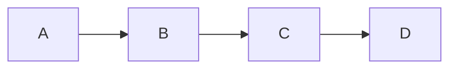
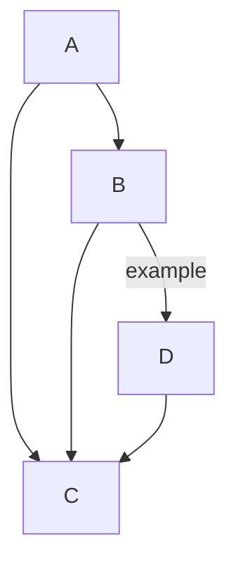
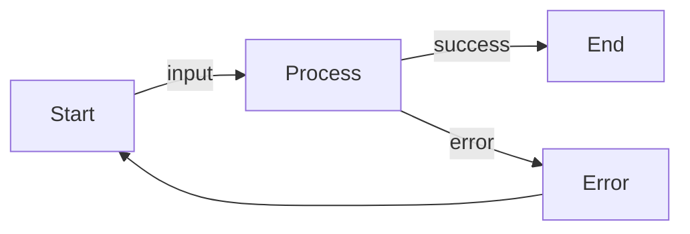
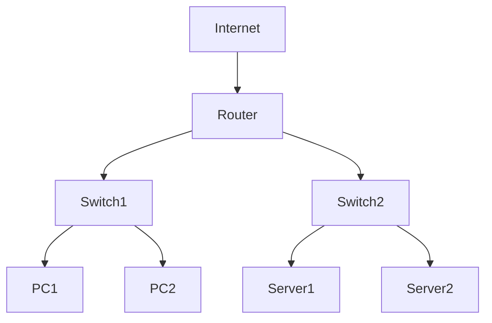

# Example Mermaid Diagrams

This file contains example mermaid diagrams for testing the vim-mermaid-ascii plugin.

## Simple Flow

## More Complex Flow

## Labeled Edges

## Network Topology

Try running `:MermaidAsciiRender` to see these diagrams rendered as ASCII art!
