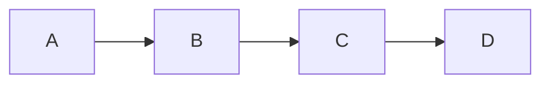
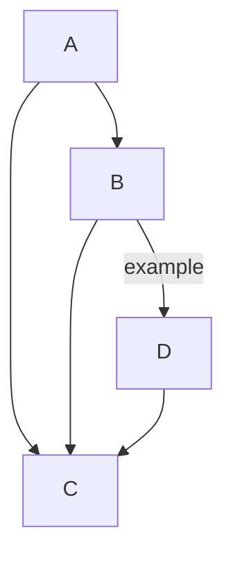
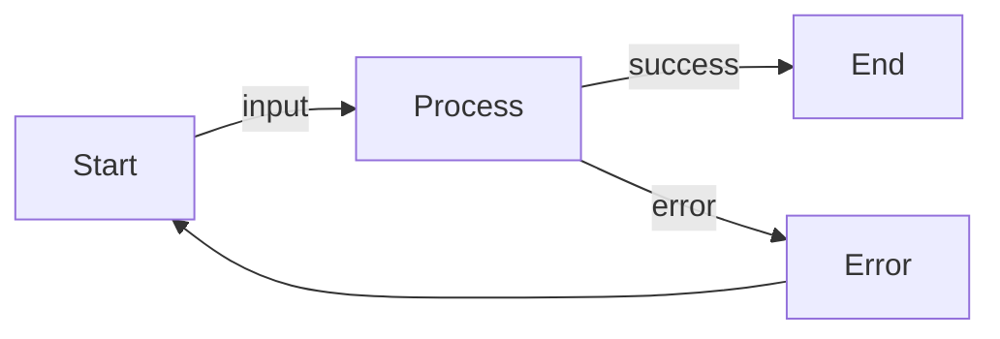
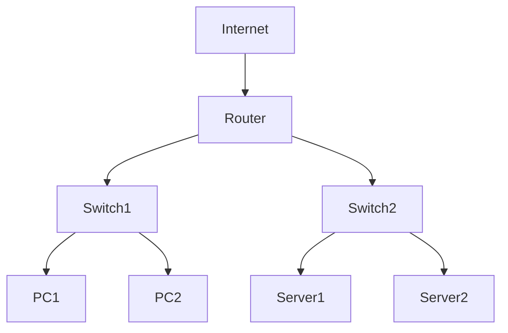
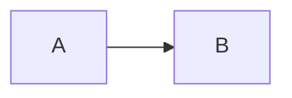

# Example Mermaid Diagrams

This file contains example mermaid diagrams for testing the vim-mermaid-ascii plugin.

## Usage

1. Open this file in Vim: `vim examples.md`
2. Create render blocks:
   - For current diagram: `:MermaidAsciiToggleBlock` or `<Leader>mb`
   - For all diagrams: `:MermaidAsciiToggle` or `<Leader>mt`
3. Edit mermaid code and move cursor away - auto-updates!
4. Or update manually: `:MermaidAsciiUpdate` or `<Leader>mu`

## Commands Quick Reference

- `<Leader>mr` - Toggle auto-update on/off
- `<Leader>mu` - Update current block
- `<Leader>ma` - Update all blocks
- `<Leader>mb` - Create/remove current render block
- `<Leader>mt` - Create/remove all render blocks

## Simple Flow



## More Complex Flow



## Labeled Edges



## Network Topology



---

After running `:MermaidAsciiToggleBlock` on a diagram, you'll see a render block appear below it:

```markdown


```mermaid-ascii-render
┌───┐     ┌───┐
│   │     │   │
│ A ├────►│ B │
│   │     │   │
└───┘     └───┘
```
```

The render block updates automatically when you edit the mermaid code (if auto-update is enabled).

**Note:** Edit the mermaid block, not the render block! The render is auto-generated.
