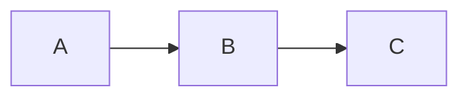
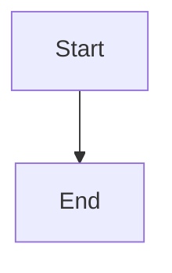

# Test Render Blocks

Test the new render block approach.

## Diagram 1



## Diagram 2



Instructions:
1. Run :MermaidAsciiRender
2. You should see ```mermaid-ascii-render blocks appear below each diagram
3. Edit a mermaid block and move cursor away - render updates!
4. Save the file - both mermaid and render blocks are saved
